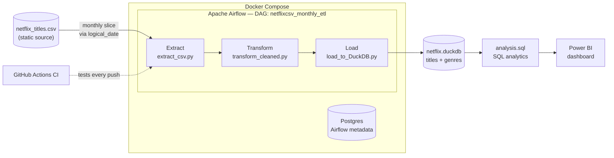

<div align="center">

# 🎬 Netflix Monthly ETL Pipeline

**A production-style batch ETL pipeline** that simulates monthly data ingestion for Netflix's content catalog — built end-to-end from a single static CSV file.


</div>

---

## 📖 Background

The [`netflix_titles.csv`](data/netflix_titles.csv) dataset is a **static snapshot** — a single file, frozen in time. In the real world, data almost never arrives that way; it streams in continuously, batch by batch, day by day.

This project treats that static file as if it were a **live production data source**, using its `date_added` column to simulate a realistic monthly ingestion pattern spanning **January 2008 to September 2021** (165 monthly batches). The goal wasn't just to clean a CSV — it was to build the same architecture a real data team would use to operationalize it: orchestrated, idempotent, containerized, and monitored.

## 🎯 Objectives

- Design an **ETL pipeline** (Extract → Transform → Load) that mirrors how production data teams structure batch workflows
- Practice **workflow orchestration** with Apache Airflow — scheduling, backfills, and task dependencies
- Model data properly with **normalization** (1NF) rather than dumping everything into one flat table
- Make every pipeline step **idempotent** — safe to re-run, retry, or backfill without corrupting data
- Containerize the entire stack so it runs identically on any machine
- Wire up **CI** so pipeline regressions are caught automatically before they reach production
- Turn the cleaned data into **actionable SQL analysis** answering real content-strategy questions

## 🏗️ Architecture



## 🧠 Concepts Demonstrated

| Concept | Where it shows up |
|---|---|
| **ETL pipeline design** | Three decoupled stages (`extract` → `transform` → `load`), each independently testable |
| **Batch / incremental ingestion** | Monthly slicing driven by Airflow's `logical_date`, not hardcoded dates |
| **Idempotency** | Extract/transform overwrite output files; load uses a delete-then-insert pattern — safe to retry or backfill any period infinitely |
| **Workflow orchestration** | Airflow TaskFlow API (`@dag`, `@task`), manual + historical backfill runs |
| **Data normalization (1NF)** | Multi-valued `listed_in` column split into a proper `genres` relationship table |
| **Data quality handling** | Detected and corrected a real column-shift anomaly in the source CSV (`rating` vs `duration`) |
| **Data warehousing** | DuckDB as an embedded OLAP store, queried with window functions, CTEs, and self-joins |
| **Containerization** | Multi-service Docker Compose stack (API server, scheduler, DAG processor, triggerer, Postgres) |
| **CI/CD** | GitHub Actions runs a DAG-integrity test on every push |

## 🛠️ Tech Stack

| Layer | Tool |
|---|---|
| Language | Python (pandas) |
| Orchestration | Apache Airflow 3.3.0 (TaskFlow API, LocalExecutor) |
| Storage / Analytics | DuckDB |
| Metadata DB | PostgreSQL 16 |
| Containerization | Docker & Docker Compose |
| CI | GitHub Actions + pytest |
| IDE | VS Code |
| BI / Visualization | Power BI |
| AI Pair Programmer | Claude Sonnet 5 (Anthropic) — used throughout for pipeline design, debugging, and documentation |

## 📁 Project Structure

```
netflix-ETL-monthly-report/
├── dags/
│   └── pipeline_dag.py          # Airflow DAG: extract >> transform >> load
├── scripts/
│   ├── extract_csv.py           # Pulls one month's rows by date_added
│   ├── transform_cleaned.py     # Cleans data, splits genres into a relation table
│   └── load_to_DuckDB.py        # Idempotent load into DuckDB
├── analysis/
│   └── analysis.sql             # 21 business-question SQL queries (basic → advanced)
├── tests/
│   └── test_dag_integrity.py    # Guards against a broken DAG file
├── data/
│   ├── netflix_titles.csv       # Source dataset
│   └── netflix.duckdb           # Output warehouse (titles + genres)
├── docker-compose.yaml          # Full local Airflow stack
├── requirements.txt
└── .github/workflows/ci.yml     # Runs tests on every push
```

## 🚀 Getting Started

```bash
# 1. Clone the repo
git clone https://github.com/nonthaphat-ratt/netflix-ETL-monthly-report.git
cd netflix-ETL-monthly-report

# 2. Create your own .env (FERNET_KEY, admin credentials) — see .env.example if provided
# 3. Spin up the full Airflow stack
docker compose up

# 4. Open the Airflow UI
# http://localhost:8080  (default: airflow / airflow)
```

Trigger the `netflixcsv_monthly_etl` DAG for a single month, or run a **Backfill** for `2008-01-01 → 2021-09-01` to populate the full history.

## 📊 Sample Insights

A few things the SQL analysis surfaced from the data:

- Non-US content share has been steadily climbing year over year — a clear localization trend
- TV Show share of new additions grew significantly over time relative to Movies
- ~67% of TV Shows on the platform are limited series (a single season)

## 🗺️ Roadmap

- [x] Extract / Transform / Load pipeline
- [x] Airflow orchestration (TaskFlow API)
- [x] Idempotent, backfill-safe design
- [x] Dockerized local environment
- [x] CI via GitHub Actions
- [x] SQL analysis layer
- [ ] Power BI dashboard
- [ ] Standalone data-quality report for null `date_added` rows

## 👤 Author

**Nonthaphat** — built as a hands-on learning project for data engineering fundamentals.
